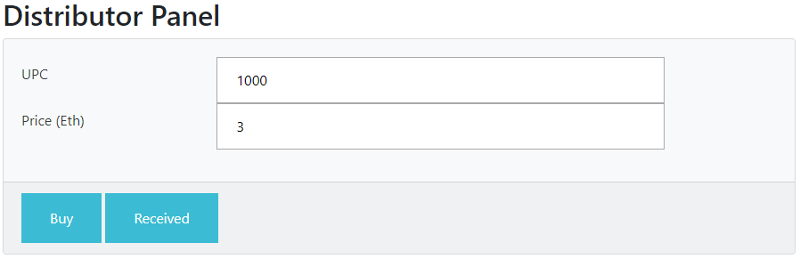
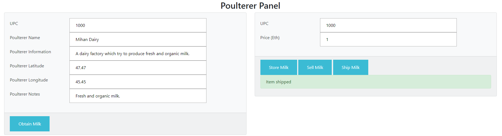
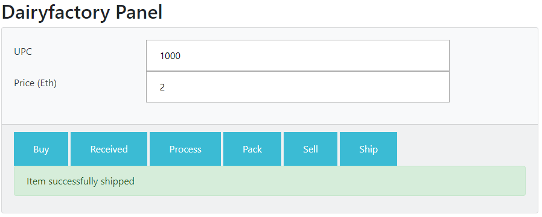
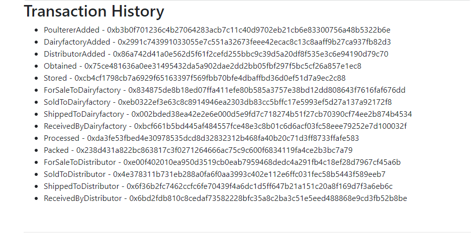
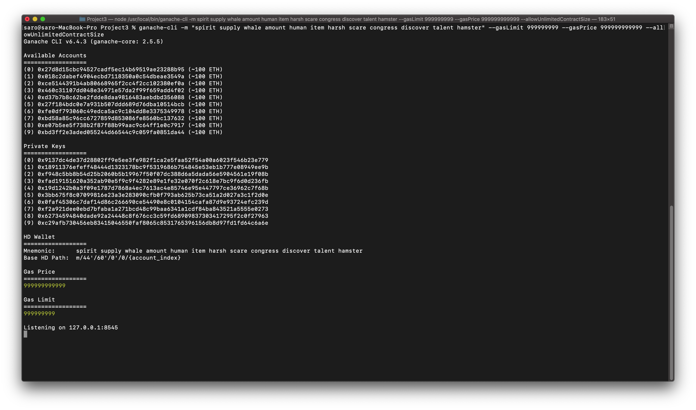
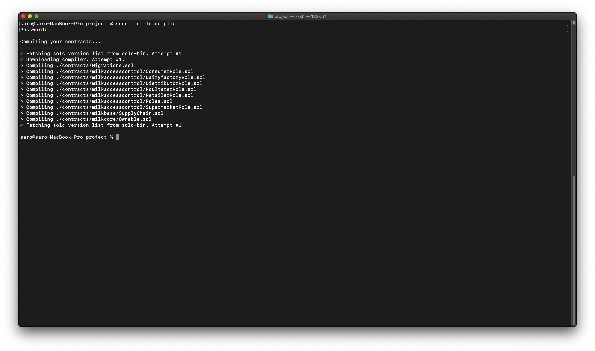
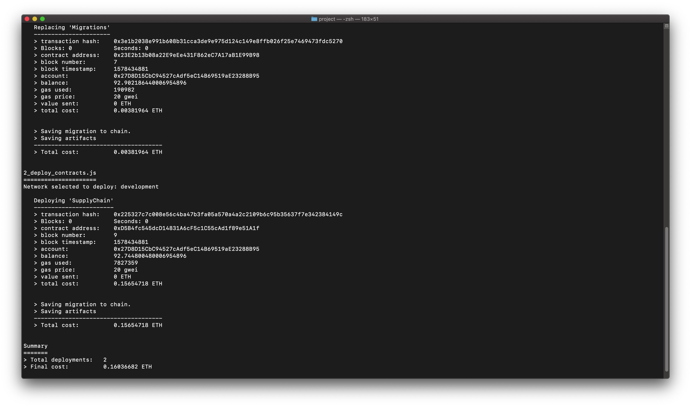
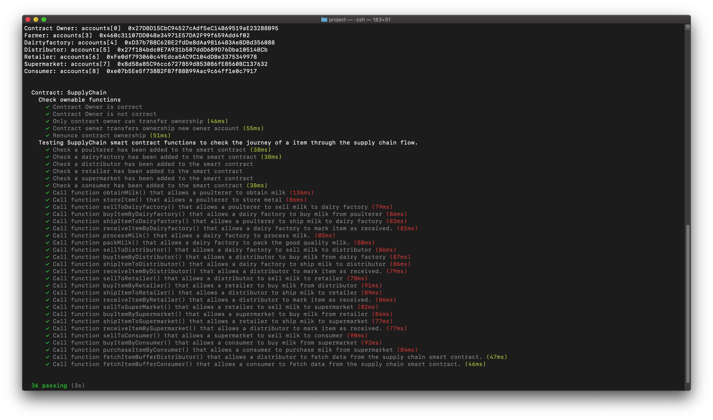

# Supply chain & data auditing

This repository containts an Ethereum DApp that demonstrates a Supply Chain flow dairyfactory suply chain system. The user story is similar to any commonly used supply chain process. A poulterer can add items to the inventory system stored in the blockchain. A dairyfactory/distributor/retailer/consumer can purchase such items from the inventory system. Additionally a poulterer/dairyfactory/distributor/retailer can mark an item as Shipped, and similarly a dairyfactory/distributor/retailer/consumer can mark an item as Received.

The DApp User Interface when running should look like...










## Deploy the contract on Rinkeby test network
* Contract Transaction Hash
`0x0c796a554371938bda4b729e0070080129d572a5f4f7f6067ba875bcdf9a8c87`
`https://rinkeby.etherscan.io/tx/0x0c796a554371938bda4b729e0070080129d572a5f4f7f6067ba875bcdf9a8c87`
* Contract Address
`0x4c7cCCd2ac05ac0e73890c9FDF553091A17E5355`
`https://rinkeby.etherscan.io/address/0x4c7cccd2ac05ac0e73890c9fdf553091a17e5355`


## Getting Started

These instructions will get you a copy of the project up and running on your local machine for development and testing purposes. See deployment for notes on how to deploy the project on a live system.

### Prerequisites

Please make sure you've already installed ganache-cli, Truffle and enabled MetaMask extension in your browser.

```
Give examples (to be clarified)
```

### Installing

A step by step series of examples that tell you have to get a development env running

Clone this repository

Change directory to ```project``` folder and install all requisite npm packages (as listed in ```package.json```):

```
cd project
npm install
```

Launch Ganache:

```
ganache-cli -m "spirit supply whale amount human item harsh scare congress discover talent hamster" --gasLimit 999999999 --gasPrice 999999999999 --allowUnlimitedContractSize
```

Your terminal should look something like this:



In a separate terminal window, Compile smart contracts:

```
truffle compile
```

Your terminal should look something like this:



This will create the smart contract artifacts in folder ```build\contracts```.

Migrate smart contracts to the locally running blockchain, ganache-cli:

```
truffle migrate --reset --network development
```

Your terminal should look something like this:



Test smart contracts:

```
truffle test test/TestSupplyChain.js
```

All 36 tests should pass.



In a separate terminal window, launch the DApp:

```
npm run dev
```

## Built With

* [Ethereum](https://www.ethereum.org/) - Ethereum is a decentralized platform that runs smart contracts
* [IPFS](https://ipfs.io/) - IPFS is the Distributed Web | A peer-to-peer hypermedia protocol
to make the web faster, safer, and more open.
* [Truffle Framework](http://truffleframework.com/) - Truffle is the most popular development framework for Ethereum with a mission to make your life a whole lot easier.


## Authors

See also the list of [contributors](https://github.com/your/project/contributors.md) who participated in this project.

## Acknowledgments

* Solidity
* Ganache-cli
* Truffle
* IPFS
